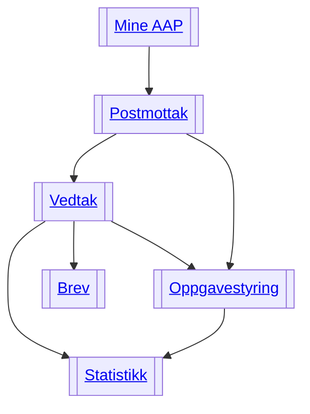

# Funksjonalitet
Komponentene våres og koblingen mellom dem. 

```mermaid
graph TD

MA[[<a href='funksjonalitet/mine_aap'>Mine AAP</a>]] --> PM[[<a href='funksjonalitet/postmottak'>Postmottak</a>]]
PM --> VT[[<a href='funksjonalitet/vedtak'>Vedtak</a>]]
VT --> OP[[<a href='funksjonalitet/oppgavestyring'>Oppgavestyring</a>]]
PM --> OP
VT --> BR[[<a href='funksjonalitet/brev'>Brev</a>]]
VT --> ST[[<a href='funksjonalitet/statistikk'>Statistikk</a>]]
OP --> ST
```

