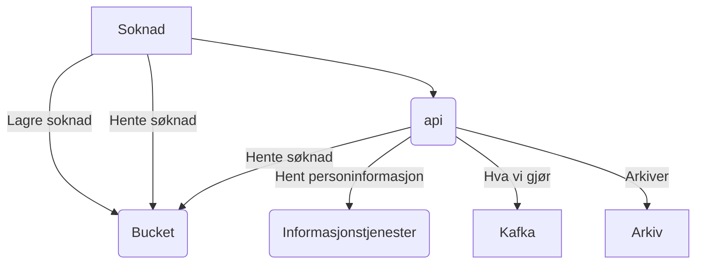

#### Systemkontekst

```mermaid
    graph TD
    A[Soknad] -->|Lagre soknad| B(Bucket)
    A -->|Hente søknad| B
    A --> C(api)
C -->|Hente søknad| B
C -->|Hent personinformasjon| D(Informasjonstjenester)
C -->|Hva vi gjør| E[Kafka]
C -->|Arkiver| F[Arkiv]
```

