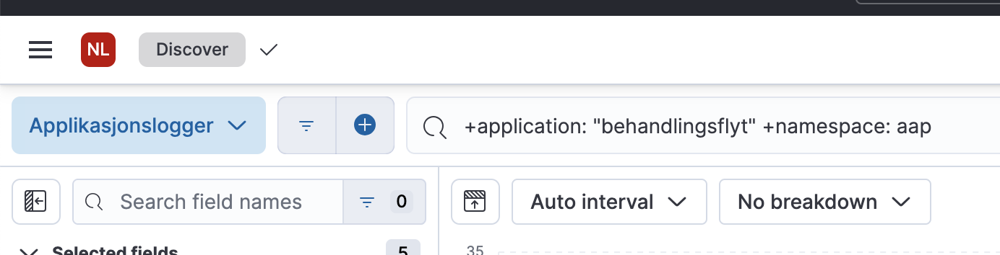

# Nyttige Lenker

## NAIS Console

[Team-oversikt](https://console.nav.cloud.nais.io/team/aap/dev-gcp/app/oppgavestyring).

[Oppgavestyring](https://console.nav.cloud.nais.io/team/aap/dev-gcp/app/oppgavestyring)
[Saksbehandling](https://console.nav.cloud.nais.io/team/aap/dev-gcp/app/saksbehandling)
[Mottak](https://console.nav.cloud.nais.io/team/aap/dev-gcp/app/mottak)

## Logger

Logger finnes i Elastic.

[Klikk her.](https://logs.adeo.no/app/discover#/?_g=(refreshInterval:(pause:!t,value:60000),time:(from:now-15m,to:now))&_a=(columns:!(level,message,envclass,application,pod),filters:!(),index:'96e648c0-980a-11e9-830a-e17bbd64b4db',interval:auto,query:(language:lucene,query:'%2Bapplication:%20%22behandlingsflyt%22%20%2Bnamespace:%20aap'),sort:!(!('@timestamp',desc)))https://logs.adeo.no/app/discover#/?_g=(refreshInterval:(pause:!t,value:60000),time:(from:now-15m,to:now))&_a=(columns:!(level,message,envclass,application,pod),filters:!(),index:'96e648c0-980a-11e9-830a-e17bbd64b4db',interval:auto,query:(language:lucene,query:'%2Bapplication:%20%22behandlingsflyt%22%20%2Bnamespace:%20aap'),sort:!(!('@timestamp',desc))))

Filtrer på `application` og `namespace` som i bildet:

## Confluence

Noe dokumentasjon lever best på Confluence.

[Produktområde AAP](https://confluence.adeo.no/pages/viewpage.action?pageId=514473022).

## Jira

[Team AAP - Jira](https://jira.adeo.no/secure/RapidBoard.jspa?rapidView=26436&projectKey=AAP&selectedIssue=AAP-48)

## SAF

SAF (sak- og arkiv-fasade) tilbyr søk mot fagarkivet (Joark/dokarkiv) og sørger for korrekt tilgangsstyring av arkivdataene.

Dokumentasjon [på Jira](https://confluence.adeo.no/display/BOA/saf).

## AAP - offisiell NAV.no-side for innbyggere

https://www.nav.no/aap
