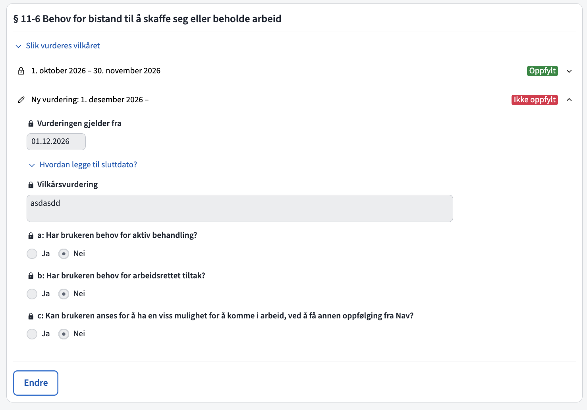
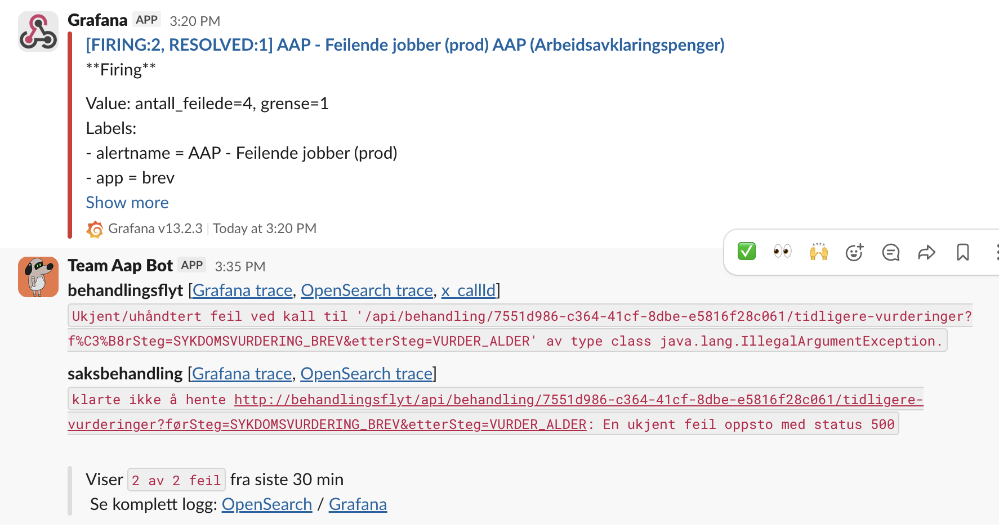
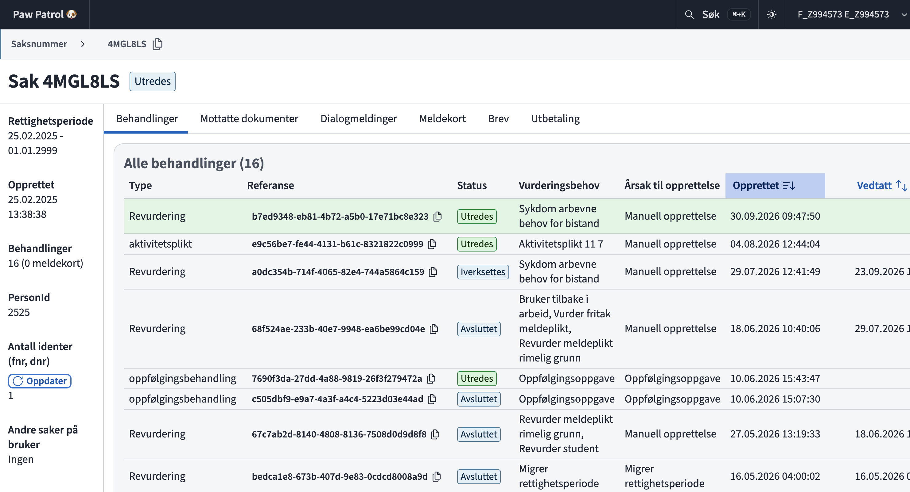

#+TITLE: Kelvin i stort og smått
#+AUTHOR: Fredrik Meyer
#+options: H:2 toc:nil
#+STARTUP: beamer
#+LATEX_CLASS: beamer
#+LATEX_CLASS_OPTIONS: [presentation,aspectratio=169]
#+LATEX_HEADER_EXTRA: \usepackage{navtheme}
#+LATEX_HEADER_EXTRA: \deftranslation[to=English]{Definition}{Definisjon}

#+name: nav-plantuml-common
#+begin_src plantuml :eval never :exports none
skinparam backgroundColor #FFFFFF
skinparam defaultFontColor #23262A
skinparam arrowColor #C30000
skinparam shadowing false
skinparam roundCorner 0
skinparam databaseBackgroundColor #F6F7F9
skinparam databaseBorderColor #5B6169
#+end_src

#+name: nav-plantuml-sequence
#+begin_src plantuml :eval never :exports none
skinparam participantBackgroundColor #FBEDED
skinparam participantBorderColor #C30000
skinparam actorBackgroundColor #F6F7F9
skinparam actorBorderColor #5B6169
skinparam sequenceLifeLineBorderColor #5B6169
skinparam sequenceGroupBorderColor #5B6169
skinparam sequenceGroupHeaderFontColor #23262A
skinparam sequenceGroupBackgroundColor #FBEDED
skinparam sequenceDividerBorderColor #5B6169
skinparam noteBackgroundColor #F6F7F9
skinparam noteBorderColor #5B6169
#+end_src

#+name: nav-plantuml-activity
#+begin_src plantuml :eval never :exports none
skinparam activityBackgroundColor #FBEDED
skinparam activityBorderColor #C30000
skinparam activityDiamondBackgroundColor #F6F7F9
skinparam activityDiamondBorderColor #C30000
skinparam activityStartColor #C30000
skinparam activityEndColor #C30000
skinparam partitionBackgroundColor #F6F7F9
skinparam partitionBorderColor #5B6169
#+end_src

* Kelvin

** Hva er Kelvin

Med Kelvin menes her hele systemet som behandler AAP-saker, /minus/ Arena og Gosys. Navnet kommer fra @@latex:\textit{\textbf{K}apittel \textbf{El}leve \textbf{v}edtak og \textbf{in}nsyn}@@[fn:7].

- Saksbehandling
- Søknad
- Meldekort
- Brev
- Journalposter på tema AAP

** Kelvin omfatter

*** Baksystemet: koden som kjører og dataen som lagres ned

*** Utviklerne, dokumentasjon, varsler og overvåking

*** Rutiner

*** Interaksjon med andre fagsystemer

  
** Eksempler på hva Kelvin gjør

*** C1                                                              :BMCOL:
:PROPERTIES:
:BEAMER_col: 0.5
:END:

- Tar i mot AAP-søknader (og ettersendinger)
- Informerer bruker på Mine AAP
- Sender brev til bruker (via sentral brev-løsning)
- Sender penger til bruker (via OS/UR)
- Implementerer Folketrygdloven Kapittel 11
- Saksbehandling og oppgave-løsning
- Statistikk og datadeling
- Tar i mot meldekort og klager

*** C2                                                              :BMCOL:
:PROPERTIES:
:BEAMER_col: 0.5
:END:

**** Hva Kelvin ikke gjør

 - Følger opp aktivitetsplan
 - Styrer tilganger
 - Oppfølging av bruker
 - Flere ting?

** Sentrale apper

*** Col 1                                                           :BMCOL:
:PROPERTIES:
:BEAMER_col: 0.5
:END:

**** Behandlingsflyt

Implementerer vilkår, og sender tilkjent ytelse videre til økonomi. Ansvarlig for å drive behandlingen framover.

**** Oppgave

Holder styr på åpne oppgaver på en behandling.

*** Col 2                                                           :BMCOL:
:PROPERTIES:
:BEAMER_col: 0.5
:END:

**** Postmottak

Lytter på alle journalposter på Tema AAP. Avgjør om dokumenter skal gå til Kelvin eller Arena.

**** Meldekort

Tar i mot meldekort fra bruker, og journalfører disse.

** Landskapet

Skisse av Kelvin-landskapet. Mange piler og bokser er utelatt.

#+begin_src plantuml :file landskap.svg :exports results :noweb yes
<<nav-plantuml-common>>
skinparam packageBackgroundColor #F6F7F9
skinparam packageBorderColor #5B6169
skinparam componentBackgroundColor #FBEDED
skinparam componentBorderColor #C30000
skinparam interfaceBackgroundColor #F6F7F9
skinparam interfaceBorderColor #5B6169

package "Brukerflater" {
  [Søknadsdialog]
  [Meldekort]
  [Mine AAP]
  [Brev]
}
database Joark
[Søknadsdialog] -> Joark
[Meldekort] -> Joark

package "Saksbehandling" {
  [Oppgave]
  [Postmottak]  -> [Behandlingsflyt]
}

[Behandlingsflyt] <-down- Arena
[Joark] -down-> Postmottak

package "Datadeling" {
  [Intern-API] as apiintern
  apiintern -> [Ekstern-API]
  [AAP-Statistikk]
}

package "Andre fagsystemer (utvalg)" as ANDRE {
 [POPP]
 [A-Inntekt]
 [Kompys]
 [MEDL]
}
Behandlingsflyt -> Økonomi
Oppgave -down-> Modia
Behandlingsflyt -> apiintern
apiintern -> Modia
apiintern -> Arena
"AAP-Statistikk" -up-> Datavarehus
Behandlingsflyt -> ANDRE
Behandlingsflyt -> Meldekort
#+end_src

#+RESULTS:
[[file:landskap.svg]]

** Behandling

*** Col 1                                                           :BMCOL:
:PROPERTIES:
:BEAMER_col: 0.5
:END:

 - En *behandling* i Kelvin er er en rekke steg som må fullføres i rekkefølge[fn:6]. Hvert *steg* kan ha "informasjonskrav" (registeroppslag). En behandling leder (ofte) til et vedtak[fn:5].

 - Kelvin har flere behandlingstyper, f.eks: revurdering, journalføring, dokumenthåndtering, oppfølgingsoppgave, klage, ...

*** Col 2                                                           :BMCOL:
:PROPERTIES:
:BEAMER_col: 0.5
:END:

**** Prinsipper

 - Kun én åpen ytelsesbehandling om gangen (ytelsesbehandling = revurdering / førstegangsbehandling)
 - Når en behandling er fullført, kan den ikke endres.
 - Man endrer på vedtaket ved å opprette en revurdering og vurdere fra et gitt tidspunkt.

** Sak

 - Tenk på en "person-mappe". Kelvin forholder seg til én sak per person [fn:4].
 - Samler behandlinger knyttet til en person: alle revurdering, klager, journalføringsbehandlinger ligger under samme sak.

** Fra søknad til penger

#+begin_src plantuml :file vei.svg :exports results :noweb yes
<<nav-plantuml-common>>
<<nav-plantuml-sequence>>

actor Søker as S
participant Søknad as SS
database Joark as J
participant Postmottak as P
participant Behandlingsflyt as B
actor Saksbehandler as SB
participant Økonomi as Ø

S -> SS : Fyller inn og sender søknad
SS -> J : Lagrer søknad i Joark
J -> P : Postmottak lytter\npå Tema AAP
P -> B : Sender videre til\nBehandlingsflyt
SB -> B : Saksbehandler søknaden
B -> Ø : Sier ifra til økonomi\nom utbetaling
B -> J : Journalfører vedtaks-PDF
#+end_src

#+ATTR_LATEX: :width \linewidth :height .75\textheight :options keepaspectratio
#+RESULTS:
[[file:vei.svg]]

** Mer detaljer i saksbehandling

*** Column 1                                                        :BMCOL:
:PROPERTIES:
:BEAMER_col: 0.4
:END:

- Første del skjer på lokalkontor
  - Kvalitetssikring på fylkesnivå, og resten hos NAY (Nasjonal oppfølgingsenhet).

- Kelvin utleder utfallet
  - Saksbehandler gir Kelvin nødvendig informasjon.

*** Column 2
:PROPERTIES:
:BEAMER_col: 0.6
:END:

#+begin_src plantuml :file saksbehandling.svg :exports results :noweb yes
<<nav-plantuml-common>>
<<nav-plantuml-sequence>>

participant Førstegangsbehandling as F
participant Behandlingsflyt as BF
actor Veileder as V
actor Kvalitetssikrer as K
actor Saksbehandler as S
actor Beslutter as B
participant Brev as Brev
participant Økonomi as Ø

F -> BF : Kelvin sjekker alder\nog lovvalg automatisk
BF -> V : Oppgave til veileder\nom å behandle § 11-5
V -> BF : Veileder svarer\npå vilkårskort
BF -> K : Kelvin oppretter oppgave
K -> BF : Kvalitetssikrer godkjenner
BF -> S : Kelvin oppretter oppgave 
S -> BF : NAY fastsetter beregningstidspunktet
BF -> S : Kelvin oppretter oppgave 
S -> BF : Samordning, institusjonsopphold, etc
BF -> BF : Kelvin regner ut\nperioder med rett
BF -> B : Kelvin oppretter oppgave\ntil beslutter
B -> BF : Beslutter godkjenner
group Samtidig
  BF -> Ø : Melding til økonomi
else
  BF -> Brev : Brev sendes
end

#+end_src

#+ATTR_LATEX: :width \linewidth :height .75\textheight :options keepaspectratio
#+RESULTS:
[[file:saksbehandling.svg]]

** En behandling er bygd av steg

- Behandlingstypen definerer stegene og rekkefølgen.
- Hvert steg har forretningslogikk og kan trenge opplysninger eller avklaringer.
- Noen steg gjør kun utregninger, andre kan opprette oppgaver.

#+begin_src plantuml :file behandlingsflyt-steg.svg :exports results :noweb yes
<<nav-plantuml-common>>

skinparam rectangleBackgroundColor #FBEDED
skinparam rectangleBorderColor #C30000
left to right direction

rectangle "Behandlingsflyt: utvalg fra Revurdering" #F6F7F9 {
  rectangle "Alder" as A
  rectangle "Sykdom" as S
  rectangle "Underveis" as U
  rectangle "Tilkjent ytelse" as T
  rectangle "Fatte vedtak" as F
  rectangle "Iverksett vedtak" as I

  A --> S
  S --> U
  U --> T
  T --> F
  F --> I
}

rectangle "FlytOrkestrator" as O #F6F7F9
O -up-> U
#+end_src

#+ATTR_LATEX: :width .8\linewidth :height .30\textheight :options keepaspectratio
#+RESULTS:
[[file:behandlingsflyt-steg.svg]]

- Kelvin[fn:2] driver flyten: fortsetter, stopper eller fører tilbake til tidligere steg.

** Tre forskjellige typer "behov" relevante for steg

- /Vurderingsbehov/: hvorfor behandlingen skal kjøres eller hva som skal vurderes.
- /Informasjonskrav/: opplysninger Kelvin må hente fra registre og andre systemer.
- /Avklaringsbehov/: spørsmål som krever svar fra saksbehandler.

#+LATEX: \begingroup\small

#+ATTR_LATEX: :align p{0.22\linewidth}p{0.36\linewidth}p{0.32\linewidth}
| Begrep                | Spørsmål                           | Eksempel                       |
|-----------------------+------------------------------------+--------------------------------|
| Vurderingsbehov       | Hvorfor skal vi behandle noe?      | Nye opplysninger fra meldekort |
| Informasjonskrav      | Hvilke opplysninger trenger vi?    | Et registeroppslag             |
| Avklaringsbehov[fn:8] | Hva må avklares før vi går videre? | En vurdering fra saksbehandler |
#+LATEX: \endgroup

** Motor - det som driver behandlingen framover                   :noexport:

*** Col 1                                                           :BMCOL:
:PROPERTIES:
:BEAMER_col: 0.5
:END:

#+begin_src plantuml :file motor.svg :exports results :noweb yes
<<nav-plantuml-common>>
<<nav-plantuml-activity>>

if (Har fakta endret seg siden sist?) is (Ja) then
        :Oppdater gjeldende steg til første steg med endret fakta;
endif
while (Finnes flere steg å gå gjennom?) is (Ja)
:Start behandling av gjeldende steg;
partition Steg {
        :Hent fakta for gjeldende steg;
        :Utfør forretningslogikk for gjeldende steg;
        if (Fant avklaringsbehov?) is (Ja) then
                :Oppgave opprettes, behandlingen stopper opp;
                stop
        else (Nei)
                :Oppdater gjeldende steg;
        endif
}
endwhile (Nei)

:Ingen flere steg, behandlingen er avsluttet.;
end

#+end_src

#+ATTR_LATEX: :width \linewidth :height .75\textheight :options keepaspectratio
#+RESULTS:
[[file:motor.svg]]

*** Col 2                                                           :BMCOL:
:PROPERTIES:
:BEAMER_col: 0.5
:END:

**** Hvordan kommer Kelvin seg videre?

Starter alltid med å hente informasjon, kjøre steg, og opprette oppgave. Gjenta.

** Motor

#+begin_src plantuml :file motor-oversikt.svg :exports results :noweb yes
<<nav-plantuml-common>>
skinparam stateBackgroundColor #FBEDED
skinparam stateBorderColor #C30000
left to right direction

state "Forbered behandling" as F
F : Oppdater fakta for tidligere steg
F : Flytt tilbake ved behov

state "Prosesser behandling" as P
P : Hent fakta for gjeldende steg
P : Kjør forretningslogikken

state "Stopp og vent" as V #F6F7F9
V : Avklaringsbehov eller ventebehov

state "Avslutt behandling" as A

F --> P
P --> P : Fortsett til neste steg
P -down-> V : Kan ikke fortsette
V -left-> F : Avklaringsbehov løst eller\nny trigger
P --> A : Ingen flere steg
#+end_src

#+ATTR_LATEX: :width \linewidth :height .60\textheight :options keepaspectratio
#+RESULTS:
[[file:motor-oversikt.svg]]

- Kjøring kan starte ved ny behandling, nye opplysninger eller når en avklaring løses.
- Endrede fakta, nye vurderingsbehov eller tidligere åpne avklaringsbehov kan føre flyten tilbake.

** Tidslinjer

For å håndtere endring over tid bruker vi /tidslinjer/. En tidslinje er en liste med ikke-overlappende perioder med tilknyttede verdier. To tidslinjer kan kombineres for å lage nye verdier.

#+begin_src plantuml :file tidslinjer.svg :exports results :noweb yes
<<nav-plantuml-common>>
skinparam TimingDiagram {
  LineColor #5B6169
  FontSize 14
}

concise "Regner det?" as R
concise "Tom kalender?" as P
concise "Gå tur?\n(ikke regn OG tom kalender)" as T

@8
R is Nei #F6F7F9
P is Ja #FBEDED
T is Ja #FBEDED

@10
R is Ja #FBEDED
T is Nei #F6F7F9

@12
R is Nei #F6F7F9
T is Ja #FBEDED

@14
P is Nei #F6F7F9
T is Nei #F6F7F9

@17
P is Ja #FBEDED
T is Ja #FBEDED

@20
R is {hidden}
P is {hidden}
T is {hidden}
#+end_src

#+ATTR_LATEX: :width \linewidth :height .6\textheight :options keepaspectratio
#+RESULTS:
[[file:tidslinjer.svg]]

** Tidslinjer for saksbehandler

*** Venstre                                                         :BMCOL:
:PROPERTIES:
:BEAMER_col: 0.5
:END:

- Saksbehandler fyller bare inn /fra og med/-dato. Vurderingen gjelder til en nyere vurdering overstyrer den.
- Sorter etter behandling (eldste først), så etter fra og med-dato.

#+begin_src plantuml :file gjeldende-vurderinger.svg :exports results :noweb yes
<<nav-plantuml-common>>
skinparam TimingDiagram {
  LineColor #5B6169
  FontSize 14
}

use date format "MMM"
scale 2678400 as 90 pixels

concise "1. A (behandling 1, fra jan)" as S1
concise "2. + B (behandling 1, fra apr)" as S2
concise "3. + C (behandling 2, fra feb) = gjeldende" as S3

@2026/01/01
S1 is "A: Oppfylt" #FBEDED
S2 is "A: Oppfylt" #FBEDED
S3 is "A: Oppfylt" #FBEDED

@2026/02/01
S3 is "C: Oppfylt" #FBEDED

@2026/04/04
S2 is "B: Ikke oppfylt" #F6F7F9

@2026/07/06
S1 is {hidden}
S2 is {hidden}
S3 is {hidden}
#+end_src

#+ATTR_LATEX: :width \linewidth :height .40\textheight :options keepaspectratio
#+RESULTS:
[[file:gjeldende-vurderinger.svg]]

*** Høyre                                                           :BMCOL:
:PROPERTIES:
:BEAMER_col: 0.5
:END:

#+ATTR_LATEX: :width \linewidth

** Vilkår

*** Vilkår                                                          :BMCOL:
:PROPERTIES:
:BEAMER_col: 0.5
:END:

**** Vilkår                                                 :B_definition:
:PROPERTIES:
:BEAMER_env: definition
:END:

Et /vilkår/ har en /type/ og en liste med perioder som enten er oppfylt, ikke oppfylt eller ikke relevant/vurdert.

**** Vilkår som tidslinjer

Et vilkår kan ses på som en tidslinje med verdier "oppfylt" / "ikke oppfylt."

*** Eksempler                                                       :BMCOL:
:PROPERTIES:
:BEAMER_col: 0.5
:END:

 - 11-5-vilkåret
   + Er oppfylt av visse kombinasjoner av ja/nei-svar.
 - Alders-vilkåret
   + Er oppfylt når bruker er mellom 18 og 67.
 - Noen vilkår kan automatisk utledes, andre må avgjøres av saksbehandler.
 
** Eksempel: Student-vilkåret

*** Forklaring                                                      :BMCOL:
:PROPERTIES:
:BEAMER_col: 0.34
:END:

#+LATEX: \setbeamerfont{itemize/enumerate body}{size=\small}\setbeamerfont{itemize/enumerate subbody}{size=\small}\small
- /Saksbehandler/ avgjør om vilkåret er oppfylt
- /Kelvin/ beregner hvor lenge retten varer (6 mnd)

**** Eksempel: avbrutt 15. januar                         :B_exampleblock:
:PROPERTIES:
:BEAMER_env: exampleblock
:END:

- 15.01–14.07: /oppfylt/
- Fra 15.07: /ikke oppfylt/

*** Diagram                                                         :BMCOL:
:PROPERTIES:
:BEAMER_col: 0.66
:END:

#+begin_src plantuml :file studentvilkar.svg :exports results :noweb yes
<<nav-plantuml-common>>
<<nav-plantuml-activity>>

start

:Lag tidslinje av saksbehandlers\nstudentvurderinger;

if (Finnes studentvurderinger?) then (Nei)
  :Ingen perioder med\nstudentvilkår;
else (Ja)
  :Finn avbrutt studiedato\nfor hver gjeldende vurdering;
  :Lag varighetstidslinje fra\navbrutt studiedato til\nseks måneder minus én dag;
  :Kombiner studentvurdering\nog varighet for hver periode;

  if (Er studentvurderingen oppfylt?) then (Nei)
    :IKKE OPPFYLT;
    note right
      Manuelt utfall
      Avslagsårsak:
      IKKE_RETT_PA_STUDENT
    end note
  else (Ja)
    if (Er perioden innenfor\nseksmånedersgrensen?) then (Ja)
      :OPPFYLT;
      note right
        Manuelt utfall fra
        studentvurderingen
      end note
    else (Nei)
      :IKKE OPPFYLT;
      note right
        Automatisk utfall
        Avslagsårsak:
        VARIGHET_OVERSKREDET_STUDENT
      end note
    endif
  endif
endif

:Returner studentvilkåret\nsom en tidslinje;

stop
#+end_src

#+ATTR_LATEX: :width \linewidth :height .75\textheight :options keepaspectratio
#+RESULTS:
[[file:studentvilkar.svg]]

** Rettighetstyper

 - Etter Kapittel 11 kan man få rett til AAP etter flere kombinasjoner av paragrafer. De forskjellige kombinasjonene kalles /rettighetstyper/[fn:3].
 - I Arena kalt "aktivitetsfaser".[fn:1]

|         | Ordinær AAP | Sykepengeerstatning | Arbeidssøker (§ 11-17) | Student |
|---------+-------------+---------------------+------------------------+---------|
| § 11-2  | Kreves      | Kreves              | Kreves                 | Kreves  |
| § 11-5  | Kreves      | --                  | --                     | --      |
| § 11-6  | Kreves      | --                  | Kreves tidligere       | --      |
| § 11-13 | --          | Kreves              | --                     | --      |
| § 11-17 | --          | --                  | Kreves                 | --      |
| § 11-14 | --          | --                  | --                     | Kreves  |

** Sporing i Kelvin

*** Col 1                                                           :BMCOL:
:PROPERTIES:
:BEAMER_col: 0.5
:END:

 - Kelvin er bygd slik at sporing er automatisk.
 - Vi lagrer svar på registeroppslag og når det ble slått opp.
 - Siden avsluttede behandlinger aldri endres, har vi historikk. Ved opprettelse av ny behandling, /kopieres/ data til den nye behandlingen.
*** Col 2                                                           :BMCOL:
:PROPERTIES:
:BEAMER_col: 0.5
:END:

#+begin_src plantuml :file sporing.svg :exports results :noweb yes
<<nav-plantuml-common>>
skinparam rectangleBackgroundColor #FBEDED
skinparam rectangleBorderColor #C30000
skinparam defaultFontSize 16
left to right direction

rectangle "Input\n(fakta + vurderinger)" as I
rectangle "App-versjon\n(git commit)" as V
rectangle "Vilkårsvurdering" as F
rectangle "Resultat" as R
database "Database" as DB

I --> F
V --> F
F --> R
I ..> DB
V ..> DB
R ..> DB
#+end_src

#+ATTR_LATEX: :width \linewidth :height .5\textheight :options keepaspectratio
#+RESULTS:
[[file:sporing.svg]]

 - Vilkårsresultater lagres ned sammen med inputten de fikk på tidspunktet de ble kjørt.

** Fra rett til penger

Etter at Kelvin har regnet ut at en person har rett på AAP, må vi beregne /tilkjent ytelse/. Dette skjer ved å kombinere mange tidslinjer.

** Beregning av tilkjent ytelse

 - Gitt rett på AAP og fakta om gradering, timer arbeid, samordning, etc., så kan man regne ut en tidslinje over hva utbetaling bør bli.

 
*** Col 1                                                           :BMCOL:
:PROPERTIES:
:BEAMER_col: 0.5
:END:

#+begin_src plantuml :file tilkjent.svg :exports results :noweb yes
<<nav-plantuml-common>>
skinparam TimingDiagram {
  LineColor #5B6169
  FontSize 14
}

use date format "MMM"
scale 2678400 as 90 pixels

concise "Underveis" as U
concise "Dagsats" as D
concise "Samordning" as S
concise "Arbeidsgradering" as GR
concise "Grunnbeløp" as G
concise "Barnetillegg" as B
concise "Tilkjent" as T

@2026/01/01
U is "null" #F6F7F9
D is " (2/3 x beregningsgrunnlag) / 260" #FBEDED
S is "100 % sykepenger" #FBEDED
GR is "100 %" #FBEDED
G is "G 2025" #FBEDED
B is "Ingen barn" #F6F7F9
T is "null" #F6F7F9

@2026/02/01
U is "Rett" #FBEDED
T is "T1" #FBEDED

@2026/03/04
T is "T2" #FBEDED
S is "0 %" #FBEDED

@2026/04/04
T is "T3" #FBEDED
B is "1 barn" #FBEDED

@2026/05/05
GR is "60 %" #FBEDED
G is "G 2026" #FBEDED
T is "T4" #FBEDED

@2026/06/05
T is "T5" #FBEDED

#+end_src

#+ATTR_LATEX: :width \linewidth :height .55\textheight :options keepaspectratio
#+RESULTS:
[[file:tilkjent.svg]]

*** Col 2                                                           :BMCOL:
:PROPERTIES:
:BEAMER_col: 0.5
:END:

 - Ved nye behandlinger (f.eks meldekort) beregnes /hele/ tidslinjen på nytt (ikke bare for "meldeperioden").
   - Fordel: lett å resonnere om
   - Ulempe: vanskelig å implementere noen endringer som bare skal gjelde fram i tid, f.eks desimalregler på avrunding
 - Vi sender en diff til utbetaling som vi regner ut selv.

** Fra meldekort til penger

*** Steg                                                            :BMCOL:
:PROPERTIES:
:BEAMER_col: 0.5
:END:

 - Behandlingsflyt holder meldekort-backend oppdatert med status på perioder med rett og perioder med meldeplikt.
 - Meldekort-løsningen ber bruker fylle ut ett og ett meldekort
 - Meldekortet journalføres i Joark.

*** asd dasd                                                        :BMCOL:
:PROPERTIES:
:BEAMER_col: 0.5
:END:

#+begin_src plantuml :file meldekort.svg :exports results :noweb yes
<<nav-plantuml-common>>
<<nav-plantuml-sequence>>

participant Påminnelse as PÅ
actor Bruker as B
database Joark as J
participant Meldekort as M
participant Postmottak as P
participant Behandlingsflyt as BF
participant Økonomi as Ø

PÅ -> B : Bruker blir påminnet kl 09
B -> M
M -> J
J -> P
P -> BF
BF -> BF : Regne ut\noppdaterte dagsatser\nbasert på timer
BF -> M : Oppdater meldekort-backend\nmed ny tilstand
BF -> Ø
#+end_src

#+ATTR_LATEX: :width \linewidth :height .75\textheight :options keepaspectratio
#+RESULTS:
[[file:meldekort.svg]]

** Automatiske behandlinger / hendelser

*** Col 1                                                           :BMCOL:
:PROPERTIES:
:BEAMER_col: 0.5
:END:

**** Hendelser

 - Lytter på PDL, foreldrepengevedtak, institusjonsopphold, Kabal-hendelser (klager), sykepengevedtak, uførevedtak, tilbakekreving-hendelser.
 - Flere kan komme.
*** Col 2                                                           :BMCOL:
:PROPERTIES:
:BEAMER_col: 0.5
:END:

**** Jobber

 - G-regulering og barnetilleggsats-økning
   - Oppretter automatiske revurderinger.
 - Fritak meldeplikt
   - Arena: "automatiske meldekort"
   - Kelvin: automatisk revurdering trigges hver uke.
** Beregning
*** Definisjon                                               :B_definition:
:PROPERTIES:
:BEAMER_env: definition
:END:

/Beregningsgrunnlaget/ er et estimat av lønn før arbeidsnedsettelse. Det brukes for å beregne dagsats.

\begin{equation}
\text{dagsats} = \frac{2 \cdot \text{grunnlag}}{3 \cdot 260}
\end{equation}
*** Hvordan beregnes grunnlaget?

Se [[https://confluence.adeo.no/spaces/PAAP/pages/641012139/Beregningsgrunnlag+flyt][Beregningsgrunnlag flyt]] på Confluence.

I kort: avhenger av yrkesskade, uføretidspunkt, tidspunkt for nedsettelse og inntekt.

** Andre ting som skjer

*** Deler hendelser til datavarehus

Statistikk over venting, hvilken enhet, resultat, etc. Også ting som diagnoser og utbetalinger.

*** Dele til resten av NAV

Via appen =api-intern=. Her er også hendelser til Modia og DSOP.

*** Si i fra på felles hendelseskø

For at tjenestepensjonsordninger skal få vite om AAP-vedtak.

** Overvåking
*** C1                                                                :BMCOL:
:PROPERTIES:
:BEAMER_col: 0.45
:END:
 - Audit-logging (når utviklere skriver til database)
 - Applikasjonslogging (Grafana/Loki, Opensearch, Google Cloud Logging ("secure logs"))
 - Metrikker
 - Alarmer (varsling på Slack til utviklere)
 - Paw Patrol (utviklerverktøy)

*** C2                                                                :BMCOL:
:PROPERTIES:
:BEAMER_col: 0.55
:END:
#+ATTR_LATEX: :width \linewidth :height .7\textheight :options keepaspectratio

** Paw Patrol

#+ATTR_LATEX: :width \linewidth :height .75\textheight :options keepaspectratio

** Ting som gjenstår

 - Krav
 - Migrere fra Arena
 - Søkere under 18
 - Simulering
 - Beregning av renter ved refusjonskrav
 - Overstyring av meldekort
 

* Footnotes

[fn:8] Avklaringsbehov gir opphav til oppgaver til saksbehandler. 
[fn:7] Lenge trodde jeg forkortelsen var  @@latex:\textit{\textbf{K}apittel \textbf{El}le\textbf{v}e \textbf{i} Folketrygdlove\textbf{N}}@@.

[fn:2] Teknisk, se  =FlytOrkestrator.kt= og =StegOrkestrator.kt=.
[fn:6] I rekkefølge har ulempen at noen ganger tvinges man gjennom steg som kanskje ikke er relevante (hvis det uansett blir avslag). 

[fn:5] Hva "vedtak" betyr får vi ta en annen gang.
[fn:4] Med unntak av når /første/ behandling trekkes av bruker. Da opprettes ny sak ved neste søknad. Ved ev. trekking av behandling nr 2, opprettes ikke ny sak.

[fn:3] Neppe et juridisk begrep. Tror kanskje juristene kaller det inngangsvilkår?

[fn:1] Se [[https://confluence.adeo.no/spaces/PAAP/pages/760456963/Rettighetstyper+n%C3%A5r+skal+de+ulike+vurderes][Confluence]]. 
